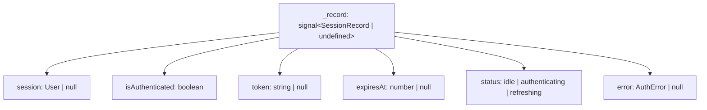
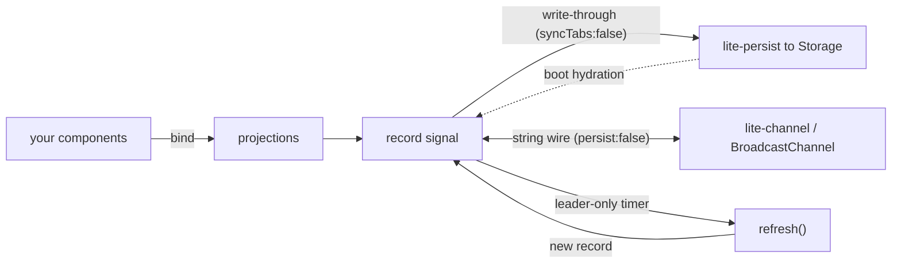

# @zakkster/lite-auth

Session-as-a-signal authentication for the `lite-*` ecosystem. The entire auth state is one reactive value; everything your UI binds to is a projection of it. Cross-tab logout, pluggable backends, optional leader-only token refresh, and durable persistence come built in. Zero runtime dependencies.

[](https://www.npmjs.com/package/@zakkster/lite-auth)
[](https://github.com/sponsors/PeshoVurtoleta)
[](https://bundlephobia.com/result?p=@zakkster/lite-auth)
[](https://www.npmjs.com/package/@zakkster/lite-auth)
[](https://www.npmjs.com/package/@zakkster/lite-auth)
[](https://github.com/PeshoVurtoleta/lite-signal)


[](./LICENSE)

- One source of truth: a private `signal<SessionRecord | undefined>`.
- Reactive projections: `session`, `isAuthenticated`, `token`, `expiresAt`, `status`, `error`.
- Cross-tab logout (and login) over `BroadcastChannel`, via `@zakkster/lite-channel`.
- Durable boot hydration and debounced write-through, via `@zakkster/lite-persist`.
- Opt-in background refresh, performed by a single leader tab to avoid rotation races.
- Hybrid error model: awaited actions throw typed `AuthError`; ambient failures surface on a signal.

## Install

```sh
npm install @zakkster/lite-auth @zakkster/lite-signal @zakkster/lite-persist
# cross-tab is optional; install it only if you set crossTab: true
npm install @zakkster/lite-channel
```

`@zakkster/lite-signal` and `@zakkster/lite-persist` are required peers. `@zakkster/lite-channel` is an optional peer, loaded lazily and only when `crossTab: true`.

## Quick start

```js
import { createAuth, fetchAdapter } from "@zakkster/lite-auth";

const auth = createAuth({
  adapter: fetchAdapter({
    signInUrl: "/api/login",
    refreshUrl: "/api/refresh",
    signOutUrl: "/api/logout",
  }),
  crossTab: true,
  refresh: { enabled: true, threshold: 60 }, // refresh 60s before expiry
});

// Bind anywhere a lite-signal value can be read.
auth.isAuthenticated.subscribe((on) => {
  document.body.dataset.auth = on ? "in" : "out";
});

await auth.ready; // boot hydration + channel attach settled

await auth.signIn({ username: "ada", password: "lovelace" });
console.log(auth.session.peek());        // { ...your user }
console.log(auth.token.peek());          // "eyJ..."

await auth.signOut();                    // every other tab logs out too
```

## The model

The whole library is projections over one private record signal. Reading a projection inside a computation tracks it, so views update automatically.



The empty state is `undefined` rather than `null`: `lite-persist` removes a stored key only when the signal value is `undefined`. The public projections still surface `null` for "no user".

## Three decoupled axes

Persistence, cross-tab sync, and refresh are independent and individually optional. They are deliberately kept on separate channels so they never fight: `lite-persist` owns disk with its own cross-tab path disabled (`syncTabs: false`), and `lite-channel` owns the wire with persistence disabled (`persist: false`).



## Cross-tab logout

This is the headline feature. With `crossTab: true`, signing in or out in one tab propagates to every other tab on the same `channelName`. A logout in one tab clears the session everywhere; a login adopts the session in the others.

```js
const auth = createAuth({ adapter, crossTab: true });
auth.onSignOut(() => router.push("/login")); // fires in the tab that logged out AND the others
```

Only user-identity-plus-token state crosses the wire, never your credentials. Under the cookie/session pattern described below, nothing secret crosses at all.

## Token refresh

Refresh is opt-in and timer-based. A refresh is scheduled `threshold` seconds before `expiresAt`; on success the new record replaces the old and the timer re-arms for the next cycle. On failure the session expires (`onSessionExpire`, then `onSignOut`).

Under `crossTab: true`, **only the leader tab refreshes**. Refresh tokens are frequently single-use, so electing one refresher avoids a rotation race where two tabs spend the same token; followers receive the rotated record over the channel.

```js
createAuth({
  adapter,
  crossTab: true,
  refresh: { enabled: true, threshold: 30 },
});
```

If the access token is a JWT and the adapter omits `expiresAt`, it is derived from the token's `exp` claim automatically.

## Persistence

Persistence is delegated to `@zakkster/lite-persist`: a synchronous boot read hydrates the session before your first paint, and writes are debounced through to storage. Choose the backend with `storage`:

- `"localStorage"` (default) survives restarts.
- `"sessionStorage"` lasts for the tab session.
- `"memory"` keeps nothing on disk (SSR, tests, or strict session-only flows).
- any Web-Storage-shaped object for a custom backend.

A corrupt stored value is discarded (not thrown) and surfaces as an `AuthError` with code `storage`; a failed write (for example a full quota) is swallowed and the session simply stays live in memory.

## Error handling

A hybrid model keeps imperative call sites honest while not letting background failures throw into the void:

- Awaited actions (`signIn`, `refresh`) reject with a typed `AuthError`.
- Ambient failures (background refresh, storage, cross-tab) update the `error` signal and call the `onError` hook.
- `signOut` is optimistic and local-first: it clears immediately, never rejects, and a failed server-side revoke never resurrects the session.

```js
try {
  await auth.signIn(creds);
} catch (e) {
  if (e.code === "invalid_credentials") showBadPassword();
  else if (e.code === "network") showOffline();
}

auth.error.subscribe((e) => { if (e) toast(e.message); });
```

`AuthError.code` is one of: `invalid_credentials`, `network`, `refresh_failed`, `no_refresh_token`, `expired`, `storage`, `aborted`, `misconfigured`.

## Custom adapters

`fetchAdapter` covers the common REST case. For anything else, implement the small adapter contract directly:

```js
const adapter = {
  async signIn(credentials, signal) {
    // return { user, accessToken, refreshToken?, expiresAt? }
  },
  async refresh(record, signal) {   // optional
    // return a fresh record
  },
  async signOut(record) {           // optional
    // revoke server-side; throwing here never resurrects the local session
  },
};
```

`signal` is an `AbortSignal` that fires when a call is superseded (a newer `signIn`, a `signOut`, or disposal), so a well-behaved adapter can cancel its in-flight request.

### Dynamic headers (token rotation)

`fetchAdapter`'s `headers` may be a static object or a getter evaluated on every request. A getter keeps a rotating value, such as an `Authorization` token refreshed in the background, fresh rather than frozen at adapter-construction time:

```js
fetchAdapter({
  signInUrl: "/api/login",
  refreshUrl: "/api/refresh",
  // re-read on every request, so a rotated token is never stale
  headers: () => ({ Authorization: `Bearer ${auth.token.peek() ?? ""}` }),
});
```

If you pass a plain object instead, its values are captured once; for any value that changes over the session (most commonly the access token), use the getter form or apply the token through your own request layer.

## A note on encrypted-cookie / httpOnly sessions

httpOnly or encrypted-cookie sessions are not outdated; they are arguably more XSS-resistant, because the token never enters JavaScript. They are a different architecture, not one this library replaces. lite-auth targets token-in-JS single-page apps because a client-side reactive library can only be reactive over state the client can actually see, and an httpOnly token is invisible to JS by design.

lite-auth can still serve the cookie model as a session mode: the token never touches storage, `signIn` posts credentials and the server sets the cookie, boot hydrates the user from a `/me` endpoint, `signOut` hits a logout endpoint, and refresh happens server-side. That pairing is in fact the most secure companion to cross-tab logout, because the only thing synced across tabs is user identity, with zero secrets on the wire. This is a planned follow-on via a `restore` adapter hook (boot hydration is storage-only today).

## API

- `createAuth(config) -> Auth` builds the controller. See `Auth.d.ts` for the full typed surface.
- `fetchAdapter(options) -> AuthAdapter` a REST adapter over fetch.
- `decodeJwtExp(token) -> number | undefined` reads a JWT `exp` as epoch ms.
- `AuthError` the typed error class.

The `Auth` object exposes the six read-only signals above, a `ready` promise, the actions `signIn` / `signOut` / `refresh`, the hook registrars `onSignIn` / `onSignOut` / `onSessionExpire` / `onTokenRefresh` (each returns an idempotent disposer), and `dispose()`. Disposing tears down timers, subscriptions, and the channel but leaves stored data intact (it is not a sign-out).

## Compatibility note

lite-auth syncs a serialized string across tabs rather than the record object. `lite-channel` applies inbound values inside a lite-signal `batch()`, which defers subscriber notification; that timing defeats the library's reference-based echo suppression for object values (each cross-tab hop is a fresh reference). A string wire dedupes by value, so an echo terminates after a single hop. This is an implementation detail, but it is the reason the wire payload is a string.

## License

MIT (c) Zahary Shinikchiev. See [LICENSE](./LICENSE).
